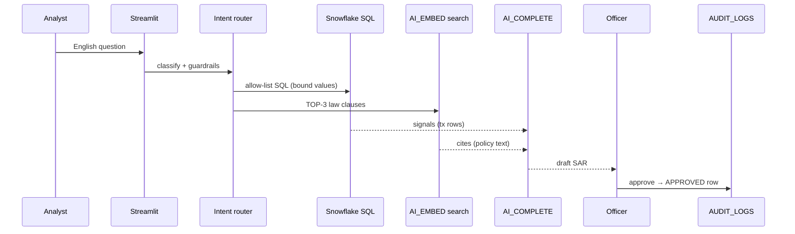

# 🛡️ Risk, Fraud & Regulatory Intelligence Copilot
### Banking / NBFC Compliance — Snowflake Cortex AI | CoCo CLI Hackathon, GCC Edition

[](https://github.com/Arunkumar06-cmd/risk-intelligence-copilot/actions)


## 🔗 Links
- **Live demo (free, runs in your browser):** https://arunkumar06-cmd.github.io/risk-intelligence-copilot/
  - Demo mode: fake sample data, SAR text from a fixed template (no AI call), nothing is sent to Snowflake. First load takes about 20-60 seconds (Python starts inside the browser via stlite).
  - Pick **analyst** or **officer** to try both sides of the sign-off.
- **Code:** https://github.com/Arunkumar06-cmd/risk-intelligence-copilot
- **Releases (with SBOM parts list):** https://github.com/Arunkumar06-cmd/risk-intelligence-copilot/releases

Ask in plain English → get **verified SQL evidence** (proof rows from the database) + **cited law clauses** + a **draft SAR** (suspicious activity report). A compliance officer must approve before anything is saved. Every approval, denied approval and denied login is written to an audit log (proof trail).

 

*Screenshots were taken with dummy Snowflake keys (login screen + empty dashboard).*

**Deck:** [`Risk_Intelligence_Copilot_Submission.pptx`](./Risk_Intelligence_Copilot_Submission.pptx)
**Tests:** 102 pytest checks. They need no Snowflake account (fake database only). CI runs them on every push.
**Guards on every push:** CodeQL (code flaw scan, for Python and our workflow files), Gitleaks (secret leak scan), pip-audit (known-bad library check). See the Actions tab.

<details>
<summary><b>🔀 Live data-flow (click to open)</b></summary>


</details>

---

## ⚡ Demo in 5 minutes

```bash
# 1. Install (requirements-dev.txt = pytest + ruff, needed only for tests/lint):
pip install -r requirements.txt -r requirements-dev.txt

# 2. Keys (local mode only):
cp .streamlit/secrets.toml.example .streamlit/secrets.toml  # add your keys

# 3. Snowflake — run in Snowsight (Snowflake web UI), in order:
sql/01_setup.sql          # tables + officer list + row locks + name masking
sql/03_rate_limit.sql     # spam-stop table + cleanup task
sql/04_cortex_search.sql  # OPTIONAL: Cortex Search service (see below)

# 4. Run:
streamlit run streamlit_app.py
```

Login → ask *“draft SAR for high-velocity wires to high-risk countries”* → review SQL + cited clauses → officer approves → download the Markdown report.

**Before the first run, check in Snowflake:**
- Your role needs the `SNOWFLAKE.CORTEX_USER` database role (permission to call Cortex AI functions).
- Cross-region inference (Snowflake may run the AI call in another region) must be on for `claude-sonnet-5`:
  ```sql
  SHOW PARAMETERS LIKE 'CORTEX_ENABLED_CROSS_REGION' IN ACCOUNT;
  -- If it says DISABLED, an ACCOUNTADMIN can run:
  ALTER ACCOUNT SET CORTEX_ENABLED_CROSS_REGION = 'AWS_US';   -- or 'ANY_REGION'
  ```
- If cross-region stays off, the app still works: it falls back to `llama3.1-8b`.
- Who may approve inside Snowflake: an admin adds Snowflake user names to `APP_OFFICERS` (`sql/01`, fill-and-run line).

## 🧠 How it works

| Step | What happens |
|---|---|
| **1. Router** | Whole-word keyword match (SAR / policy / tx review) → allow-list SQL templates (only pre-written queries) with bound params (user text is passed as a value, never pasted into SQL). Blocked words + char allow-list reject injection (bad input that tries to change the SQL). |
| **2. Evidence + Law** | Snowflake SQL pulls transaction signals. `AI_EMBED` + cosine search (meaning match score) returns TOP-3 law clauses. Optional: Cortex Search (see below). |
| **3. Report** | `AI_COMPLETE` with Cortex Guard ON (harm filter, set as `model_parameters => {'guardrails': TRUE}`) writes a short SAR draft. |
| **4. Human check** | Officer must approve. The check runs on the server at approve time: in Snowflake (SiS) the viewer's user name must be in the `APP_OFFICERS` list; locally the app login must hold COMPLIANCE_OFFICER. Only then is the APPROVED row written to `AUDIT_LOGS`. A blocked try writes an `APPROVE_DENIED` row. |

**Trust built in:** officer allow-list (`APP_OFFICERS`), app-side row lock (non-officers never get RESTRICTED-tier rows) + name masking, SQL row-access policies + name masking policy as a second layer, per-user rate limits (fail closed = block if the check breaks), prompt/result hashes (fingerprints), `QUERY_ID` per report, denied-login + denied-approval audit, safe Markdown export (no raw SQL).

## 🤖 Models (set in `backend/config.py`)

| Role | Model | Why |
|---|---|---|
| Main | `claude-sonnet-5` | GA (generally available, fit for production), 1M token context. Needs cross-region inference. |
| Draft + fallback | `llama3.1-8b` | GA, cheap. Native (runs in-region) in some regions, e.g. AWS US West 2. |
| Embeddings | `snowflake-arctic-embed-m-v1.5` | 768-number vector per clause. |

- Not used: `mistral-large3` is public preview (Snowflake: "not suitable for production"). `mistral-large2` is legacy (old, closing) since Aug 12 2026.
- Stuck with cross-region off? `llama3.3-70b` (GA, native in AWS US West 2) is a stronger in-region option. Add it to `ALLOWED_LLM_MODELS` and set it as `PRIMARY_MODEL`.
- Audit log stores the model name as the version label (Cortex puts the version in the model name). No made-up version tags.
- Source: [regional availability](https://docs.snowflake.com/en/user-guide/snowflake-cortex/aisql-regional-availability), [cross-region inference](https://docs.snowflake.com/en/user-guide/snowflake-cortex/cross-region-inference), [Aug 2026 model deprecations](https://docs.snowflake.com/en/release-notes/bcr-bundles/un-bundled/bcr-august-model-deprecations).

## 🔎 Optional: Cortex Search (better law-clause search)

- Cortex Search = hybrid search (vector meaning match + keyword match + rerank, a second-pass re-score).
- Off by default. Turn on: run `sql/04_cortex_search.sql`, then set `USE_CORTEX_SEARCH = "TRUE"` in secrets.
- The app calls it through the Python API (`snowflake-core`). On any error, or zero hits, it falls back to the cosine search.
- In Cortex Search mode the Law tab shows **no match score** (the app asks only for POLICY_ID, TITLE, CLAUSE_TEXT). Cosine mode still shows it.
- Not tested on a live account.

## ☁️ Run inside Snowflake (SiS = Streamlit in Snowflake)

**Status: built + unit-tested, not live-tested.**

- **How it starts:** `backend/runtime.py` detects SiS from the runtime: a stored procedure (warehouse runtime) or the container host + session token file (container runtime). Then the app skips the secrets check and uses `st.connection("snowflake")` (Snowflake's own session). No keys are stored in the app. ([source](https://docs.snowflake.com/en/developer-guide/streamlit/app-development/secrets-and-configuration))
- **Bound values everywhere:** the SiS connection uses `?` placeholders (qmark style), the local one uses `%s`. One small adapter (`run_sql`) swaps the placeholder per connection. Values are always bound, never pasted.
- **Who may approve:** the viewer's Snowflake user name comes from `st.user.user_name`. Approval needs that name in the `APP_OFFICERS` table (`sql/01`). It is checked again on the server at approve time, so the UI role cannot fake it. ([source](https://docs.snowflake.com/en/developer-guide/streamlit/app-development/personalization))
- **Data hiding:** SiS runs every query with the app owner's rights, so `CURRENT_ROLE()` policies cannot tell viewers apart. So the app itself hides RESTRICTED-tier rows and masks a customer-name column for non-officers. Officer status is looked up on the server on every call, so a removed officer loses access on the next click. The SQL policies stay as a second layer. ([source](https://docs.snowflake.com/en/developer-guide/streamlit/features/row-access))
- **Deploy:** `sql/02_sis_deploy.sql` makes a **container runtime** app (Python runs in a Snowflake container) with compute pool (container host) `RISK_APP_POOL` and Snowflake's PyPI mirror, so the `streamlit==1.64.0` pin can install. Admin steps (grants, compute pool, warehouse time cap) are commented "fill and run". The app is created by a separate app owner role (`USE ROLE <APP_OWNER_ROLE>`), not the admin role. Safe to re-run (`CREATE OR REPLACE`).
- **Make it live:** `CREATE STREAMLIT` alone does not start the app. `sql/02` then runs `ALTER STREAMLIT RISK_COPILOT_APP ADD LIVE VERSION FROM LAST;` (or open the app once in Snowsight with the owner role). ([source](https://docs.snowflake.com/en/sql-reference/sql/create-streamlit))
- Compute pool access on trial accounts is not confirmed.

## 🔐 Security model and limits

- **SiS (multi-user):** per-viewer identity from `st.user`; officer = listed in `APP_OFFICERS` (only the admin role that owns the table can change it).
- **Local mode is a single-user demo:** one app password, a role dropdown (shows/hides the Approve button only), and one Snowflake login (`SNOWFLAKE_ROLE`). The real gate is that login's COMPLIANCE_OFFICER role. `ALLOW_LOCAL_APPROVE` is a demo-only switch, default FALSE.
- **Not live-tested on Snowflake:** Cortex calls, SQL scripts, SiS deploy and Cortex Search are checked by docs + fake-DB tests only.
- **Later:** multi-team roles, SSO (company login) for local mode, shared (Redis) per-minute limits.

## 📁 Repo map

```
risk_copilot/
├── streamlit_app.py        # chat UI, metrics, approve flow, transactions
├── backend/
│   ├── hybrid_agent.py     # router + search + AI_COMPLETE + officer gate + audit log
│   ├── runtime.py          # local vs SiS detection, st.user viewer, SiS connection
│   ├── demo.py             # DEMO MODE only: fake sample rows, sample clauses, template SAR
│   └── config.py           # secrets, models, limits (single source)
├── sql/
│   ├── 01_setup.sql        # DB, tables, APP_OFFICERS list, policies, masks
│   ├── 02_sis_deploy.sql   # Streamlit-in-Snowflake deploy (container runtime)
│   ├── 03_rate_limit.sql   # rate-limit table + cleanup task
│   └── 04_cortex_search.sql # OPTIONAL Cortex Search service
├── tests/
│   ├── test_guards.py      # input guard + router basics (9)
│   ├── test_agent_sql.py   # SQL shape, model guards, router, OCSP, search fallback, one search per question (35)
│   ├── test_app_smoke.py   # Streamlit AppTest: local + SiS screens, no DB; pipeline searches once (8)
│   ├── test_sis_mode.py    # SiS detection, qmark adapter (fakes + real connector classes), officer list, denied-approval audit, masking, rate limit, int-only LIMIT/OFFSET (41)
│   └── test_demo_mode.py   # demo mode: no DB touched, RESTRICTED rows hidden, template draft, officer-only approve, AppTest end to end (9)
├── site/index.html         # GitHub Pages page: loads the app in the browser (stlite 1.9.2)
├── requirements.txt        # app runtime pins (what SiS installs)
├── requirements-dev.txt    # pytest + ruff (CI / dev only)
└── Risk_Intelligence_Copilot_Submission.pptx
```

## 🧪 Tests

```bash
pip install -r requirements.txt -r requirements-dev.txt
python -m pytest tests/ -q   # 102 passed
ruff check .                 # lint (same rules as pre-commit)
```

## 💰 Cost

- **Trial account:** AI features are off on self-service trials until you add a credit card. Adding a card does not upgrade the trial or end it. ([source](https://docs.snowflake.com/en/user-guide/admin-trial-account))
- **Prices** (AI credits per 1M tokens, input / output, Snowflake Service Consumption Table, effective Sep 30 2026):
  - `claude-sonnet-5`: 1.20 / 6.00
  - `llama3.1-8b`: 0.132 / 0.132
  - `AI_EMBED` with `snowflake-arctic-embed-m-v1.5`: 0.03
  - Cortex Guard (harm filter) also bills per input token it checks.
  - Cortex Search (optional): 6.3 AI credits per GB per month of indexed data.
- Demo data is tiny and prompts are capped (350 words), so a demo run uses very few credits.

## ❗ Not verified

- No live Snowflake run was done for this version: Cortex calls, SQL scripts, SiS deploy and Cortex Search are untested on a real account.
- What *is* tested: Python logic with a fake database, SQL text shape (both `%s` and `?` styles), the officer gate, and the Streamlit screens in local and SiS mode (AppTest, no network).

## 🗺️ Beyond the demo

Live Snowflake test run → real-time screening queue → multi-regulator packs (RBI / FinCEN / Basel) → SSO + key-pair auth in prod → scheduled re-embedding of new circulars.

---
MIT License — see [LICENSE](./LICENSE).
