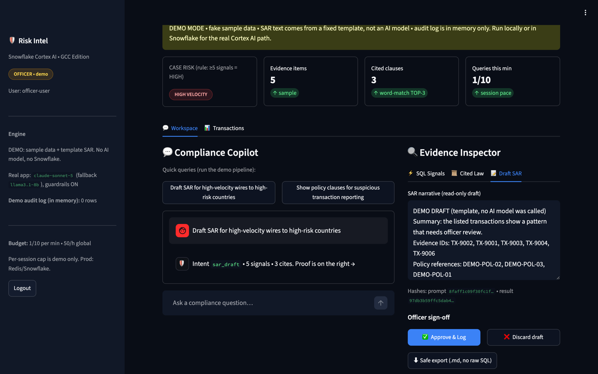
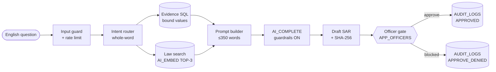
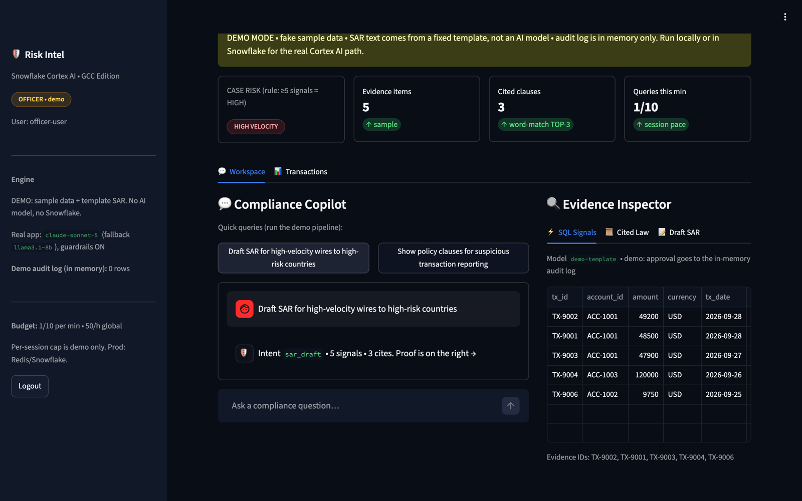
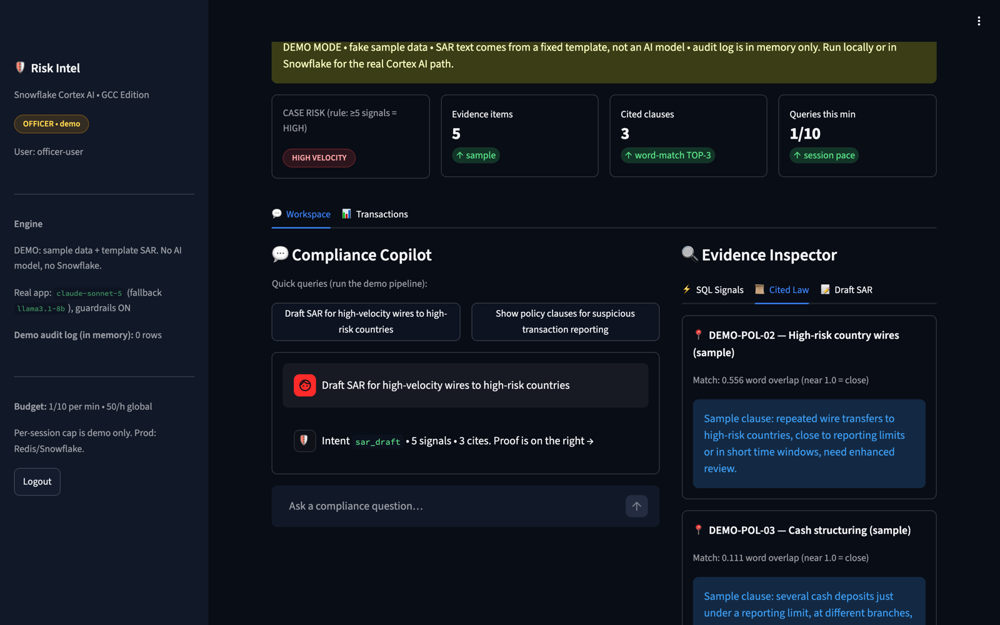

<!-- HEADER -->
<div align="center">


# Risk Intelligence Copilot

<p>
  <strong>An AI copilot for bank and NBFC compliance teams.</strong><br />
  Ask in plain English. Get proof rows from the database, the three rule clauses that fit, and a draft Suspicious Activity Report.<br />
  Nothing is saved until a listed compliance officer approves it.
</p>

<!-- QUICK LINKS -->
<p>
  <a href="https://arunkumar06-cmd.github.io/risk-intelligence-copilot/"></a>
  <a href="https://arunkumar06-cmd.github.io/risk-intelligence-copilot/context.html"></a>
  <a href="docs/deck/Risk_Intelligence_Copilot_Submission.pptx"></a>
</p>

<!-- STATUS -->
<p>
  <a href="https://github.com/Arunkumar06-cmd/risk-intelligence-copilot/actions/workflows/ci.yml"></a>
  <a href="https://github.com/Arunkumar06-cmd/risk-intelligence-copilot/actions/workflows/security.yml"></a>
  <a href="https://github.com/Arunkumar06-cmd/risk-intelligence-copilot/actions/workflows/pages.yml"></a>
  <a href="https://github.com/Arunkumar06-cmd/risk-intelligence-copilot/releases"></a>
  
  
  <a href="LICENSE"></a>
</p>

<sub>CoCo CLI Hackathon · GCC Edition · Team <b>Behelit</b> · Arun Kumar (solo)</sub>

</div>

<br />

<p align="center">
  
</p>

## ✨ What it does

| | |
|---|---|
| **Evidence, not guesses** | Fixed, allow-listed SQL pulls the transaction rows. User text is sent as a bound value (separate from the SQL), never pasted into the query. |
| **Law by meaning** | `AI_EMBED` turns each rule clause into 768 numbers; cosine similarity picks the TOP-3 clauses for the question. Cortex Search (hybrid search) is optional. |
| **A draft with receipts** | `AI_COMPLETE` (`claude-sonnet-5`, fallback `llama3.1-8b`) writes the SAR with the Cortex Guard harm filter always on. Every draft is fingerprinted with SHA-256. |
| **A human signs** | Only users in `APP_OFFICERS` can approve. The check runs on the server at click time. Denied tries are logged under the real viewer's name. |

## 🚀 Try it

**1 · In your browser (no install, no keys).** Open the **[live demo](https://arunkumar06-cmd.github.io/risk-intelligence-copilot/)**.
- Pick *analyst* or *officer* and press a quick query.
- Demo mode uses fake sample data and a template draft (no AI call), and sends nothing to Snowflake.
- The first load takes 20–60 seconds while Python starts in the browser.

**2 · On your machine.**

```bash
git clone https://github.com/Arunkumar06-cmd/risk-intelligence-copilot.git && cd risk-intelligence-copilot
pip install -r requirements.txt -r requirements-dev.txt

DEMO_MODE=TRUE streamlit run streamlit_app.py      # demo mode, no keys needed
# or, for the real Snowflake path:
cp .streamlit/secrets.toml.example .streamlit/secrets.toml   # add your Snowflake keys + APP_PASSWORD
streamlit run streamlit_app.py
```

**3 · Inside Snowflake.**
- In Snowsight (the Snowflake web UI), run `sql/01_setup.sql`, then `sql/03_rate_limit.sql`, then `sql/02_sis_deploy.sql`.
- Full steps and grants are in **[docs/ARCHITECTURE.md](docs/ARCHITECTURE.md)**.

## 🛠️ Ecosystem & tooling

<table>
  <tr>
    <td align="center" width="25%"><strong>AI & data</strong></td>
    <td align="center" width="25%"><strong>App</strong></td>
    <td align="center" width="25%"><strong>Quality gates</strong></td>
    <td align="center" width="25%"><strong>Delivery</strong></td>
  </tr>
  <tr>
    <td valign="top">• Snowflake Cortex AI<br>• <code>AI_COMPLETE</code> + Cortex Guard<br>• <code>AI_EMBED</code> (arctic-embed-m-v1.5)<br>• Cortex Search (optional)</td>
    <td valign="top">• Streamlit 1.64<br>• Python 3.11<br>• Snowflake connector 4.7.5<br>• stlite (browser demo)</td>
    <td valign="top">• pytest (102 tests)<br>• ruff + pre-commit (7 hooks)<br>• CodeQL · Gitleaks · pip-audit<br>• Dependabot</td>
    <td valign="top">• GitHub Actions (4 workflows)<br>• GitHub Pages (live demo)<br>• python-semantic-release<br>• SBOM on every release</td>
  </tr>
</table>

## 🧭 How it works



The plain-words version, with the real SQL and numbers behind each box, is in the **[Feynman explainer](https://arunkumar06-cmd.github.io/risk-intelligence-copilot/context.html)**.

## 📊 Engineered metrics

| Metric | Value | Where it is enforced |
|---|---|---|
| Law clauses per question | **3** | `config.TOP_K` |
| Evidence rows per draft | **5** | `config.EVIDENCE_TX_LIMIT` |
| AI calls without the harm filter | **0** | `AI_COMPLETE_SQL` sets `{'guardrails': TRUE}`; no unguarded retry |
| Max question length · prompt size | **2000 chars · 350 words** | `MAX_INPUT_LEN`, `MAX_PROMPT_WORDS` |
| Rate limits | **10 / min / session · 50 / hour / user** | `check_rate`, `RATE_LIMIT` table (fails closed) |
| Automated tests | **102** (no Snowflake needed) | `tests/` |

<p align="center">
  
  
  
</p>

<details>
<summary><b>More screenshots</b></summary>
<br />


</details>

## 📁 Project structure

```text
.
├── streamlit_app.py            # UI: login, KPI strip, chat, evidence inspector, officer sign-off
├── backend/
│   ├── hybrid_agent.py         # guard → router → evidence SQL → law search → AI draft → officer gate → audit
│   ├── runtime.py              # where am I running? local · Snowflake (SiS) · viewer identity
│   ├── demo.py                 # demo mode: sample rows, sample clauses, template draft
│   └── config.py               # settings, model allow-lists, limits (single source of truth)
├── sql/                        # run in order: 01 setup · 02 SiS deploy · 03 rate limit · 04 optional Cortex Search
├── tests/                      # 102 pytest checks, fake database only
├── site/index.html             # GitHub Pages shell that runs the app in the browser (stlite)
├── docs/
│   ├── ARCHITECTURE.md         # deep reference: pipeline, models, SiS deploy, security model, cost
│   ├── context.html            # Feynman explainer (also live on Pages)
│   ├── deck/                   # hackathon slides (.pptx)
│   └── assets/                 # screenshots
├── .github/                    # CI, security, release, Pages workflows · issue/PR templates · Dependabot
├── context.md                  # handoff notes for the next engineer or agent
├── CHANGELOG.md · CONTRIBUTING.md · SECURITY.md · LICENSE
└── pyproject.toml · requirements.txt · requirements-dev.txt · .pre-commit-config.yaml · .editorconfig
```

## 📚 Documentation

| Read this | When you want |
|---|---|
| [Feynman explainer](https://arunkumar06-cmd.github.io/risk-intelligence-copilot/context.html) | The idea in plain words, then the real machinery |
| [docs/ARCHITECTURE.md](docs/ARCHITECTURE.md) | Models, Cortex Search, the Snowflake deploy, security model, cost |
| [context.md](context.md) | Handoff notes and decisions that must not regress |
| [CONTRIBUTING.md](CONTRIBUTING.md) | Setup, checks to run, commit format |
| [SECURITY.md](SECURITY.md) | How to report a hole, the scans that run, the access model |
| [CHANGELOG.md](CHANGELOG.md) · [Releases](https://github.com/Arunkumar06-cmd/risk-intelligence-copilot/releases) | What changed in each version |

## 🔐 Security at a glance

- **Inputs:** a character allow-list, blocked SQL words, 2000-character cap, bound values only, and integer-only `LIMIT`/`OFFSET`.
- **AI:** Cortex Guard is always on, `temperature 0`, and only allow-listed models can be called.
- **People:**
  - Inside Snowflake, approval is checked per viewer against `APP_OFFICERS`.
  - RESTRICTED accounts are hidden from analysts, and customer names are masked.
- **Output:** tags are stripped before display, and the export never contains SQL.
- **Honest limit:** not yet run on a live Snowflake account. Every path is covered by fake-database tests and checked against the Snowflake docs. See [ARCHITECTURE.md](docs/ARCHITECTURE.md).

## 👤 Team

**Behelit**: Arun Kumar ([@Arunkumar06-cmd](https://github.com/Arunkumar06-cmd)), solo build for the CoCo CLI Hackathon, GCC Edition.

## License

[MIT](LICENSE)
