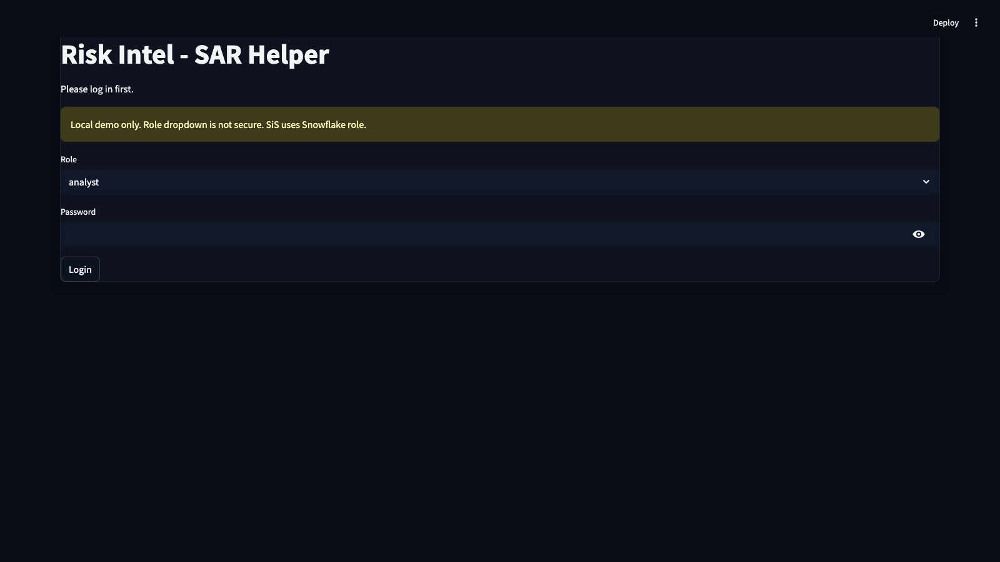
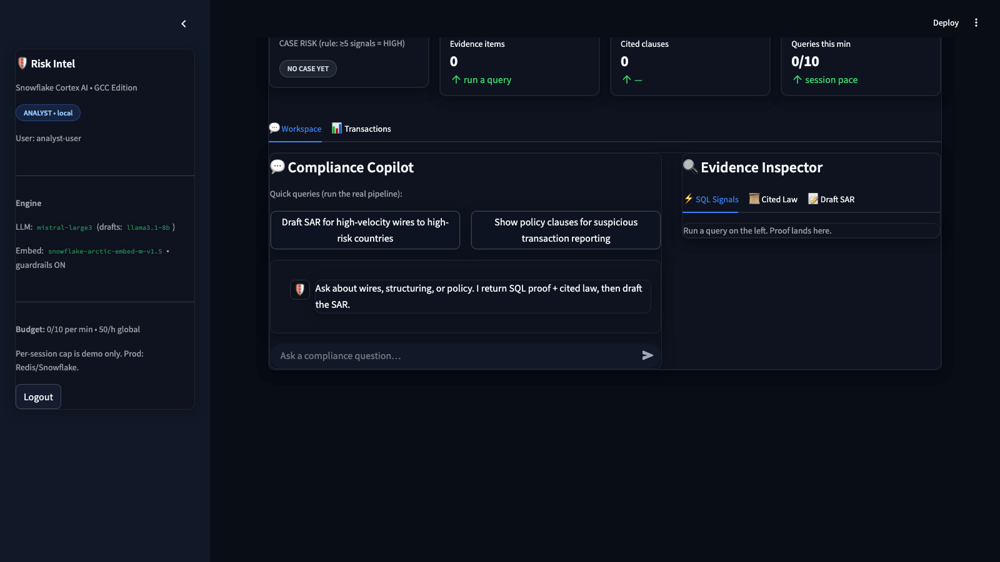
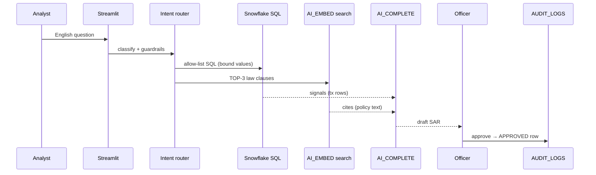

# 🛡️ Risk, Fraud & Regulatory Intelligence Copilot
### Banking / NBFC Compliance — Snowflake Cortex AI | CoCo CLI Hackathon, GCC Edition

[](https://github.com/Arunkumar06-cmd/risk-intelligence-copilot/actions)


Ask in plain English → get **verified SQL evidence** + **cited law clauses** + **draft SAR**, with every step logged. No black box. Officer approves before anything is filed.

 

**Deck:** [`Risk_Intelligence_Copilot_Submission.pptx`](./Risk_Intelligence_Copilot_Submission.pptx)
**Tests:** 9 guard-rail pytest checks, run green on every push (see CI badge ↑).
**Guards:** CodeQL + secret scan + pip audit on every push (see Security badge ↑↓ in Actions).

<details>
<summary><b>🔀 Live data-flow (click to open)</b></summary>


</details>

---

## ⚡ Demo in 5 minutes

```bash
# 1. Snowflake — run in Snowsight (web UI), in order:
sql/01_setup.sql        # tables + row locks + name masking
sql/03_rate_limit.sql   # spam-stop table + cleanup task

# 2. App — local:
pip install -r requirements.txt
cp .streamlit/secrets.toml.example .streamlit/secrets.toml  # add trial keys
streamlit run streamlit_app.py
```

Login → ask *“draft SAR for high-velocity wires to high-risk countries”* → review SQL + cited clauses → officer approves → download the Markdown report.

## 🧠 How it works

| Step | What happens |
|---|---|
| **1. Router** | Keyword intent (SAR / policy / tx review) → allow-list SQL templates with bound params. Blocked words + char allow-list reject injection. |
| **2. Evidence + Law** | Snowflake SQL pulls transaction signals; `AI_EMBED` + cosine vector search returns TOP-3 regulation clauses. |
| **3. Report** | `AI_COMPLETE` (mistral-large3, llama3.1-8b drafts, guardrails ON) writes a short SAR draft. |
| **4. Human check** | Officer MUST approve (role verified in Snowflake). Only then is the APPROVED report written to `AUDIT_LOGS`. |

**Trust built in:** row-access policies + customer-name masking, per-user rate limits, prompt/result hashes, `QUERY_ID` per report, denied-login audit, safe Markdown export (no raw SQL leaks).

## 📁 Repo map

```
risk_copilot/
├── streamlit_app.py        # chat UI, metrics, approve flow, transactions
├── backend/
│   ├── hybrid_agent.py     # router + vector search + report + audit log
│   └── config.py           # secrets, models, limits (single source)
├── sql/
│   ├── 01_setup.sql        # DB, tables, policies, masks
│   ├── 02_sis_deploy.sql   # Streamlit-in-Snowflake deploy
│   └── 03_rate_limit.sql   # rate-limit table + cleanup task
├── tests/test_guards.py    # 9 guard-rail tests (pytest)
└── Risk_Intelligence_Copilot_Submission.pptx
```

## 🧪 Tests

```bash
python3 -m pytest tests/test_guards.py -q   # 9 passed
```

## 💰 Cost — ~$0 demo

Snowflake Trial ($400 free credit) + `AI_EMBED` / `AI_COMPLETE` on tiny demo data + Streamlit (Cloud free / SiS included). Heavy models only on short, truncated prompts.

## 🗺️ Beyond the demo

Real-time screening queue → multi-regulator packs (RBI / FinCEN / Basel) → SSO + key-pair auth in prod → scheduled re-embedding of new circulars.

---
MIT License — see [LICENSE](./LICENSE).
